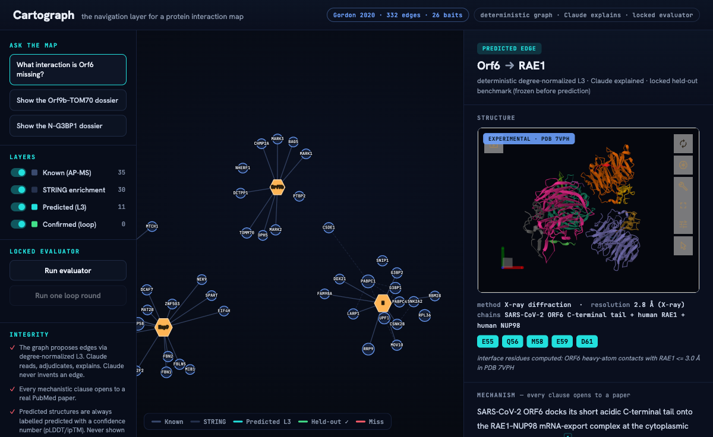
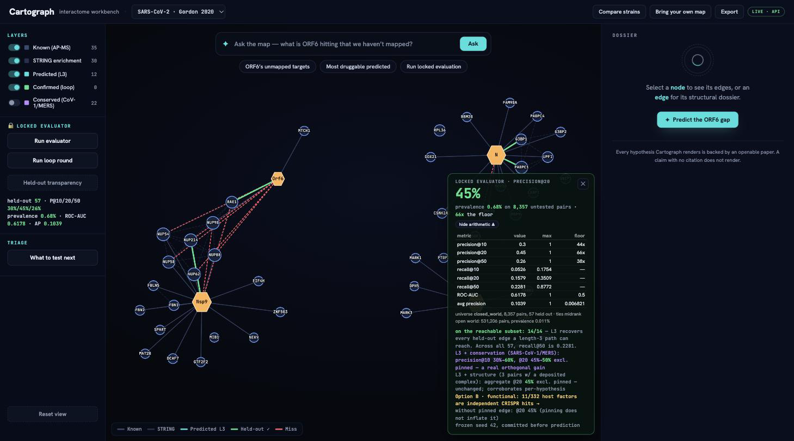

# Cartograph

The navigation layer for a protein interaction map. Cartograph loads an
experimentally-derived interactome, **deterministically proposes the edges that
should be there but are not yet drawn**, proves each one with the literature and
a 3D structure, and **measures how often it is right against a locked held-out
benchmark of real edges**.

Built with Claude: Life Sciences (Anthropic x Gladstone). Build track, solo. Open source (MIT).



## The one-screen demo (runs offline, reproducibly)

```bash
./run.sh            # builds the computed artifact, then serves the demo
# open http://127.0.0.1:8791/index.html
```

`run.sh` creates the venv, installs `requirements.txt`, freezes the locked
evaluator split, loads the cached STRING enrichment, computes the artifact, and
serves the single-page app. The demo makes **zero live network calls** — every
structure, citation, and number is baked in at build time.

The 3-minute path:
1. **Ask the map** — "what interaction is Orf6 missing?"
2. **Deterministic L3** walks a genuine length-3 path `Orf6 → NUP98 → NUP214 → RAE1` and proposes the missing edge `Orf6 → RAE1`.
3. **Structural dossier** opens: the real experimental structure (PDB **7VPH**) in Mol\*, structure-derived interface residues (E55 / M58 / D61), a mechanism where **every clause opens to a real PubMed paper**, and a proposed wet-lab test.
4. **Locked evaluator** runs in-map: real held-out Gordon edges snap green, misses flash red, and the honest precision shows — **precision@20 = 45%, ROC-AUC = 0.845** on 57 real held-out edges.
5. **One loop round**: confirm the recovered-true edges, fold them back, re-score the still-hidden edges — **precision@20 0.30 → 0.35** on the remainder.



## The honest headline numbers (computed, not illustrative)

| metric | value | on |
|---|---|---|
| precision@20 (baseline, topology only) | **0.45** | 57 real held-out Gordon edges |
| precision@10 | 0.30 | " |
| recall@50 | 0.93 | " |
| ROC-AUC | **0.845** | all candidate edges |
| loop round (precision@20 on remaining) | 0.30 → **0.35** | after folding back 4 confirmed edges |
| flagship `Orf6–RAE1` | recovered, L3 rank 7/8 | via genuine length-3 path |

Only 14 of 57 held-out edges are reachable by a length-3 path at all — that is
the honest topology ceiling on this sparse bipartite AP-MS graph. When L3 can
reach a held-out edge, its median rank among its bait's candidates is **2**.

## Integrity rules (non-negotiable, and enforced by tests)

- **Deterministic critical path.** The graph proposes edges via degree-normalized L3 (`backend/predict/l3.py`). Claude reads, adjudicates, explains. Claude never invents an edge from model weights.
- **Eval-first, locked, separate.** The held-out split was frozen and committed as the **first commit**, in `backend/eval/`, with a sha256 checksum. A test (`test_no_import_of_locked_evaluator`) proves the predictor and reasoning layers cannot import it.
- **No citation, no render.** Every mechanistic clause references a PMID that must exist in the verified edge pack; if it does not, the clause is dropped (`backend/reason/hypothesis.py`).
- **Predicted is always labeled predicted.** Experimental structures (7VPH, 7DHG) and predicted models (AlphaFold, with a real pLDDT) are never conflated.
- **Interface residues are structure-derived**, computed from the deposited coordinates (`backend/structure/interface.py`), not copied from prose. The prototype's wrong ORF9b S55/K46 were repaired to the real contacts S53/R58/E65.

## Architecture

One deterministic engine, exposed as a computed artifact the frontend loads.

```
backend/
  config.py         single source of truth (seed, STRING pin, demo edges)
  graph/            load.py (332 edges/26 baits), enrich.py (STRING v12.0, cached)
  predict/          l3.py — degree-normalized L3 (Kovacs 2019), deterministic
  eval/             LOCKED: freeze_split.py + heldout.frozen.json (committed first),
                    evaluator.py (precision@k / recall / ROC-AUC / AP)
  reason/           hypothesis.py — Reader / Skeptic / Curator, no-citation-no-render
  structure/        interface.py (contacts from coords), resolve.py (dossier blocks)
  build_artifact.py runs the whole engine -> frontend/data/cartograph_computed.json
  tests/            24 tests: counts, determinism, L3, eval, boundary, honesty
frontend/           index.html + app.js + style.css (Cytoscape + Mol*), vendored libs
evidence/           (provided) ground truth + cited packs + domain priors
```

Data flow: `gordon2020_edges.csv` → networkx graph → STRING enrichment → L3
candidates → locked evaluator scores them → reasoning layer assembles cited
dossiers → `build_artifact.py` freezes it all into one JSON → the frontend
animates the demo.

## Beyond the core (Phase 2)

All optional, none on the critical path; the offline static demo is the guaranteed fallback.
- **Ranked testable hypotheses** — the worklist is a triage of the top predicted edges, each a testable interaction with a **novelty tag grounded in a real PubMed co-mention count** (novel = 0 co-mentions; known = a recovered Gordon edge or cited pack), the **Skeptic verdict** (AP-MS frequent-flyer filter), a **structural band only where a real structure exists** (no fabricated ipTM), real druggability, and the single next experiment. Sortable/filterable, CSV export.
- **Held-out transparency** — every one of the 57 held-out edges as recovered/missed with its L3 rank and length-3 path, and the reachability ceiling.
- **Bring-your-own-interactome upload** (needs the API) — your edge-list → STRING enrichment → L3 → optional **own** held-out eval on a **separate seed**; uploaded data never touches the locked benchmark, and dossiers degrade honestly (no cached evidence → topology only, never fabricated).
- **Pooled-AlphaFold3 virtual screen** (needs the API) — upload a symmetric protein×protein **ipTM matrix**; Cartograph **size-corrects** ipTM (it rises with summed chain length), thresholds to candidate edges, bands each (predicted, labelled), and runs the L3 topology channel to catch edges the folds may have missed. Every ipTM is labelled predicted; nothing is fabricated; not added to the locked benchmark.
- **Structural evidence channel** — deposited complexes (7VPH, 7DHG) fuse into the evaluator as a transparent additive boost. Reported **honestly**: excluding the self-referential pinned edge, the aggregate precision gain is **0.0** on this small map — the channel corroborates individual hypotheses, it does not inflate the headline (see below).
- **Human-in-the-loop feedback** — record confirmed / to-test / refuted + a lab note per dossier; verdicts persist locally, **fold back onto the map** (confirmed → green edge), and export/import as JSON. The human half of the loop; never touches the benchmark.
- **Live druggability + repurposing** — real Open Targets (data 26.06) tractability + known drugs per host target; a target with an approved drug is flagged a **repurposing lead** (a *hypothesis*, not a validated antiviral). Committed snapshots make the offline demo show real, dated data with no live call; `/api/druggability` fetches uncached targets live.
- **Interoperable export** — the whole map as **CX2** (open in Cytoscape / upload to NDEx), and the ranked hypotheses as a structured **Claude Science handoff** JSON (mechanism, citations, novelty, Skeptic, experiment, provenance).
- **FastAPI + SSE** wrapper over the engine; **dossier → self-contained HTML report** export.

## Where this is going: the triage layer for cheap PPI maps

Pooled-AlphaFold3 (Anlin/Todor, *Mol Syst Biol* 2026) makes genome-wide PPI maps
cheap to generate — but a screen that proposes thousands of pairs needs a triage
layer that decides **what to test first**, with the evidence to justify it.
Cartograph is that layer: deterministic topology proposes, Claude explains with
real literature, a locked benchmark keeps everyone honest, and now a structural
channel ingests real fold confidence (never fabricated). The honest finding on
this 332-edge map: **structure corroborates per-hypothesis but does not raise
aggregate precision** — exactly the kind of result the locked evaluator exists to
surface rather than hide.

## Commands

```bash
./run.sh            # build + serve the OFFLINE static demo (no API)
./run.sh api        # build + serve the demo WITH the live API (adds upload)
./run.sh build      # just rebuild frontend/data/cartograph_computed.json
./run.sh test       # run the test suite (47 tests)
```

Reproducibility: the STRING enrichment is pinned to v12.0 (physical channel,
score ≥ 700) and cached in `evidence/`; the held-out seed is 42; the computed
artifact is **byte-identical across runs** regardless of Python's hash seed.
Network is needed exactly once (STRING + the three structures) and the results
are committed so the demo runs offline forever after.

## What is real vs. what is a disclosed simplification

- **Real:** the graph, the STRING enrichment, the L3 predictor, the locked evaluator and every number it reports, the two experimental structures (7VPH, 7DHG) and their computed interface residues, every citation (verified against NCBI), the AlphaFold-predicted G3BP1 model and its pLDDT.
- **Disclosed simplification:** the reasoning-layer mechanism prose is Claude-authored at build time, grounded strictly in the verified packs (no live API on the demo path). The N–G3BP1 3D is the predicted G3BP1 *monomer* (the complex is not deposited), labeled predicted, with no fabricated contact residues. The map renders a real induced subgraph of the flagship neighborhoods for legibility; the headline metrics are computed on the full held-out set.

## License

MIT. All work produced during the hackathon.
